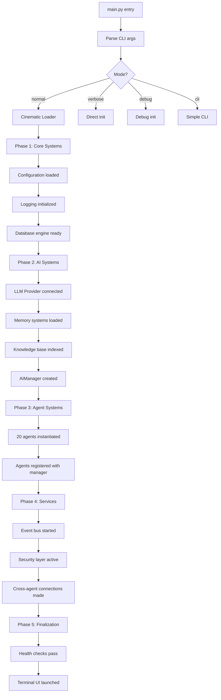
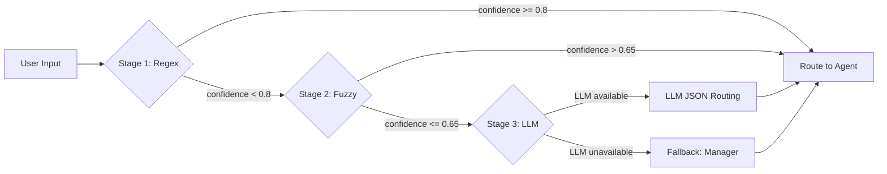
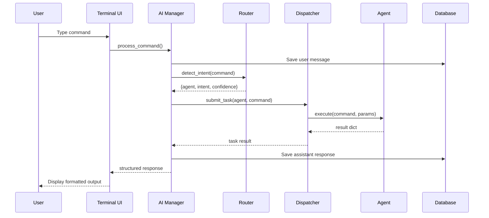
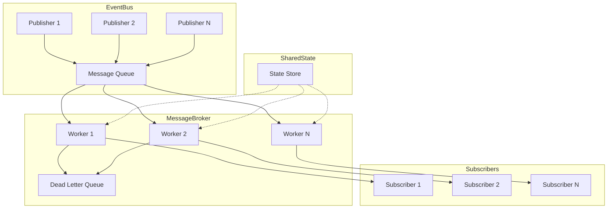
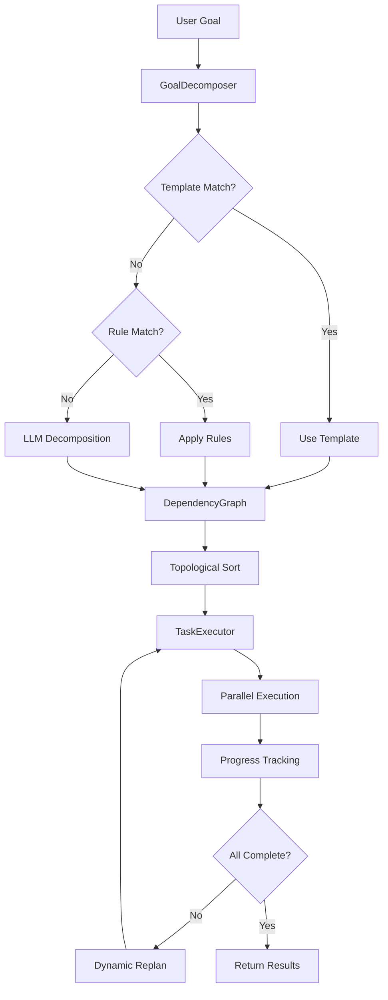
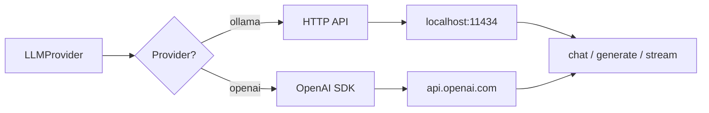
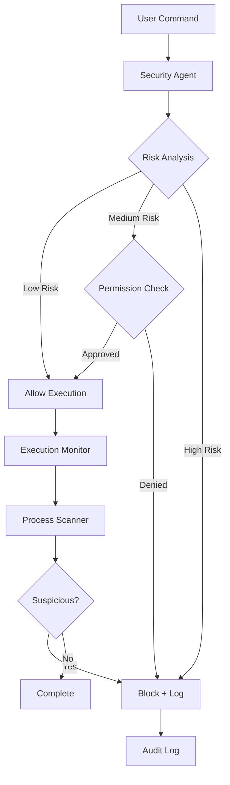
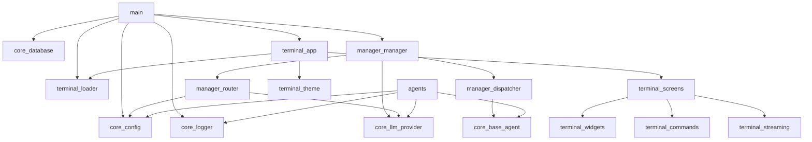

# NEXUS Architecture

> Deep system architecture, component relationships, and execution pipelines.

## System Overview

NEXUS is a layered, event-driven AI operating environment built around a central orchestration model. The system is organized into five architectural layers:

```
┌──────────────────────────────────────────────────────────────┐
│  Layer 5: Terminal Presentation (Textual/Rich)               │
│  ┌────────────┐ ┌──────────┐ ┌──────────┐ ┌───────────────┐ │
│  │ Dashboard  │ │   Chat   │ │  Tasks   │ │ Cinematic     │ │
│  │ Screen     │ │ Screen   │ │ Screen   │ │ Loader        │ │
│  └────────────┘ └──────────┘ └──────────┘ └───────────────┘ │
├──────────────────────────────────────────────────────────────┤
│  Layer 4: Orchestration (AI Manager)                         │
│  ┌────────────┐ ┌──────────┐ ┌──────────┐ ┌───────────────┐ │
│  │  Router    │ │Dispatcher│ │  LLM     │ │ Session Mgmt  │ │
│  │ (3-stage)  │ │          │ │ Provider │ │               │ │
│  └────────────┘ └──────────┘ └──────────┘ └───────────────┘ │
├──────────────────────────────────────────────────────────────┤
│  Layer 3: Agent Layer (21 Specialized Agents)                │
│  ┌─────────────┬──────────────┬────────────────────────────┐ │
│  │ Core Agents │ Meta Agents  │ Infrastructure Agents      │ │
│  │ File, Web,  │ Planner,     │ Comm Bus, Analytics,       │ │
│  │ Coding,     │ Marketplace, │ Security, Learning,        │ │
│  │ Automation, │ Workflow     │ Context Awareness          │ │
│  │ Vision, ... │ Chain        │                            │ │
│  └─────────────┴──────────────┴────────────────────────────┘ │
├──────────────────────────────────────────────────────────────┤
│  Layer 2: Service Layer                                      │
│  ┌────────────┬─────────────┬─────────────┬────────────────┐ │
│  │ Storage    │ Vector DB   │ Scheduling  │ Event Bus      │ │
│  │ (SQLite,   │ (ChromaDB)  │ Engine      │ (Pub/Sub)      │ │
│  │  JSON)     │             │             │                │ │
│  └────────────┴─────────────┴─────────────┴────────────────┘ │
├──────────────────────────────────────────────────────────────┤
│  Layer 1: Infrastructure                                     │
│  ┌────────────┬─────────────┬─────────────┬────────────────┐ │
│  │ Config     │ Logging     │ Database    │ LLM Providers  │ │
│  │ Manager    │ System      │ Engine      │ (Ollama/OpenAI)│ │
│  └────────────┴─────────────┴─────────────┴────────────────┘ │
└──────────────────────────────────────────────────────────────┘
```

## Startup Lifecycle



## 3-Stage Routing Pipeline



### Stage 1: Regex Matching
- 200+ compiled regex patterns across all agents
- Confidence calculated from match coverage
- Threshold: >= 0.8 for direct routing

### Stage 2: Fuzzy Keyword Matching
- Uses `difflib.get_close_matches` for typo tolerance
- Per-agent keyword dictionaries (10-30 keywords each)
- Threshold: > 0.65 for routing

### Stage 3: LLM Understanding
- JSON-formatted prompt with agent descriptions
- Returns `{"agent": "...", "intent": "...", "confidence": 0.0-1.0}`
- Falls back to manager if LLM unavailable or confidence low

## Command Execution Flow



## Agent Architecture

All agents inherit from `BaseAgent` (abstract class):

```python
class BaseAgent(ABC):
    name: str
    description: str
    status: AgentStatus  # IDLE, BUSY, ERROR, OFFLINE

    @abstractmethod
    def execute(command, params) -> Dict
    @abstractmethod
    def get_capabilities() -> List[str]
```

### Agent Categories

| Category | Agents | Purpose |
|----------|--------|---------|
| **Core** | File, Web, Coding, Automation, Terminal | Direct user task execution |
| **Perception** | Vision, Context Awareness | Screen/window/activity understanding |
| **Cognitive** | Memory, Knowledge, Learning | Persistent memory and pattern learning |
| **Meta** | Planner, Marketplace, Workflow Chain | Multi-agent orchestration |
| **Infrastructure** | Communication Bus, Analytics, Security | System-level services |
| **UX** | Notification, Scheduler, Personality | User experience enhancement |

## Communication Bus Architecture



### Components
- **EventBus**: Thread-safe pub/sub with 8 workers, priority queues
- **MessageBroker**: TTL-based message routing with retry logic (3 retries, 1s delay)
- **SharedStateManager**: Optimistic concurrency control, lock/unlock entries
- **EventLogger**: In-memory + persistent event log (5000 max, 7-day retention)
- **DeadLetterQueue**: Failed message storage with retry/purge capabilities

## Planner Agent Architecture



## Storage Systems

| System | Location | Purpose |
|--------|----------|---------|
| **SQLite** | `data/nexus.db` | Tasks, conversations, bus messages, plans, marketplace |
| **JSON** | `data/memory/` | Memory entries, preferences, workflows |
| **ChromaDB** | `data/knowledge_vectors/` | Vector embeddings for knowledge search |
| **SQLite** | `data/analytics.db` | Usage analytics, performance metrics |
| **SQLite** | `data/security.db` | Security events, audit logs, permissions |
| **SQLite** | `data/context.db` | Context history, activity tracking |
| **SQLite** | `data/learning.db` | Learned patterns, behavior history |
| **SQLite** | `data/workflow_chains.db` | Chain executions, templates |
| **JSON** | `data/scheduler/` | Scheduled tasks, execution history |
| **JSON** | `data/plugins/` | Plugin registry |

## LLM Provider Architecture



- **Unified interface**: `chat()`, `generate()`, `stream()` methods
- **Auto-fallback**: OpenAI -> Ollama if API key missing or package unavailable
- **Streaming**: Token-by-token generation for real-time terminal output
- **Health check**: `is_available()` probes Ollama `/api/tags` endpoint

## Terminal UI Architecture

```
terminal/
├── app.py              # Main Textual App, screen management, key bindings
├── theme.py            # NEXUS dark theme CSS, color tokens
├── loader.py           # Cinematic startup loader, spinners, progress
├── commands.py         # Slash command parser, registry, autocomplete
├── streaming.py        # Token streaming handler, typing animation
├── widgets.py          # Reusable widgets (Header, StatusBar, Message, etc.)
└── screens/
    ├── dashboard.py    # Startup dashboard with system stats
    ├── chat.py         # Main chat interface with sidebar
    └── tasks.py        # Task monitor and agent status grid
```

### Screen Navigation
```
Dashboard --[command]--> Chat
Dashboard --[Ctrl+K]--> Tasks
Chat --[Escape]--> Dashboard
Tasks --[Escape]--> Previous
```

### Key Bindings
| Key | Action |
|-----|--------|
| `Ctrl+C` | Quit application |
| `Ctrl+D` | Quit application |
| `Ctrl+L` | Clear screen |
| `Ctrl+K` | Show task monitor |
| `Ctrl+H` | Return to dashboard |
| `Escape` | Go back |

## Security Architecture



### Security Layers
1. **Command Analysis**: Regex-based pattern matching against blocklists
2. **Permission Rules**: 8 configurable permission rules
3. **Process Scanning**: `psutil`-based process monitoring
4. **Audit Logging**: Persistent event trail in `data/security.db`
5. **File Protection**: Configurable protected paths
6. **Plugin Sandbox**: AST-based static analysis, blocked imports

## Configuration System

Single JSON configuration file at `config/settings.json` with dot-notation access:

```python
config.get("llm.provider")           # "ollama"
config.get("agents.file_agent.enabled")  # True
config.set("llm.ollama.model", "llama3.2")
```

- **Singleton pattern**: Single config instance shared across all components
- **Auto-save**: Changes persist immediately to disk
- **Default fallback**: Built-in defaults if config file missing
- **Hierarchical**: Nested structure with dot-notation traversal

## Logging Architecture

```
Logger (singleton)
├── File Handler (RotatingFileHandler)
│   ├── Path: logs/nexus.log
│   ├── Max size: 10MB
│   └── Backup count: 5
├── Console Handler (StreamHandler)
│   └── Level: configurable (normal/verbose/debug)
└── Child Loggers (per-component)
    ├── NEXUS.NEXUS
    ├── NEXUS.AIManager
    ├── NEXUS.Router
    ├── NEXUS.LLMProvider
    └── ... (one per agent/service)
```

### Log Levels
| Mode | Console Level | File Level |
|------|--------------|------------|
| Normal | WARNING+ | DEBUG |
| Verbose | INFO+ | DEBUG |
| Debug | DEBUG | DEBUG |

## Dependency Graph



## Async Architecture

- **TaskDispatcher**: Thread pool (4 workers) for concurrent agent execution
- **EventBus**: 8 worker threads for async event processing
- **TaskExecutor** (Planner): Parallel task execution (3 concurrent, 300s timeout)
- **StreamingResponse**: Async token streaming with callback support
- **Background threads**: Scheduler daemon, Learning analysis, Context monitoring

## Plugin System

```
agents/plugin_agent/
├── agent.py              # PluginAgent orchestrator
├── plugin_manager.py     # Plugin lifecycle management
├── plugin_sandbox.py     # Restricted execution environment
├── plugin_security.py    # AST-based static analysis
└── plugins/              # Plugin directory
    └── *.py              # Individual plugin files
```

### Plugin Lifecycle
1. **Discovery**: Scan `plugins/` directory for `.py` files
2. **Verification**: AST analysis for blocked imports, dangerous operations
3. **Registration**: Add to registry with metadata
4. **Execution**: Run in restricted sandbox with timeout
5. **Management**: Enable/disable/uninstall via PluginAgent
