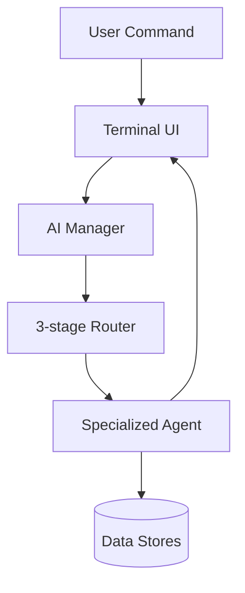
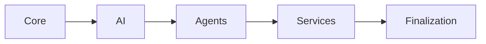

# NEXUS User Manual

> Official handbook for the terminal-native NEXUS AI ecosystem.
>
> This manual is generated from the current repository implementation (startup flow, command routing, agents, terminal UI, workflows, plugins, and storage behavior).

---

## 1. Introduction

NEXUS is a local-first, terminal-native AI operating environment built around a central AI manager and a network of specialized agents. You interact through natural language commands (and a slash-style command layer in chat), while the platform routes intent, executes tasks, and persists state across sessions.

This guide is for:

| Audience | What you’ll get |
|---|---|
| End users | Daily operation, startup, commands, workflows |
| Power users | Multi-agent chains, planning, automation, context-driven usage |
| Developers | Architecture-aware usage, config surfaces, debug and diagnostics |
| Contributors | Practical contribution entry points |

---

## 2. What is NEXUS

NEXUS combines:

1. **Terminal UI layer** (Textual + Rich): dashboard, chat, tasks, cinematic loader.
2. **AI orchestration layer**: manager, router, dispatcher, LLM provider.
3. **Agent layer**: 20–21 specialized agents (depending on startup path; see troubleshooting note).
4. **Service/data layer**: SQLite + JSON + optional vector storage.



---

## 3. Core Concepts

### 3.1 Agent-Oriented Execution
Each domain action (files, web, coding, security, workflows, planning, etc.) is handled by a dedicated agent.

### 3.2 Three-Stage Intent Routing
NEXUS routes commands through:

1. **Regex rules** (fast, deterministic; confidence `>= 0.8`)
2. **Fuzzy matching** (typo-tolerant; confidence `> 0.65`)
3. **LLM routing** (JSON intent selection when enabled and available)

### 3.3 Session Persistence
NEXUS stores task history, conversation records, memory, workflow data, analytics, and security/audit data in `data\`.

### 3.4 Local-First AI
Default provider is **Ollama** (`http://localhost:11434`), with optional OpenAI support.

---

## 4. Installation

## 4.1 Quick Setup

```bash
git clone https://github.com/your-org/nexus.git
cd nexus
python -m venv .venv

# Linux/macOS
source .venv/bin/activate

# Windows
.venv\Scripts\activate

pip install -r requirements.txt
```

## 4.2 Start Ollama (default local LLM)

```bash
ollama serve
ollama pull llama3
```

## 4.3 Launch NEXUS

```bash
python main.py
```

---

## 5. System Requirements

| Requirement | Details |
|---|---|
| Python | `3.10+` |
| OS | Windows/Linux/macOS (project includes Windows-focused app/process mappings) |
| LLM backend | Ollama recommended (local) |
| Optional cloud LLM | OpenAI API key + `openai` package |
| Terminal UI | `textual`, `rich` |

Core dependencies are in `requirements.txt`; advanced agent capabilities (vision/knowledge/etc.) may need additional packages noted in `INSTALLATION.md`.

---

## 6. First Launch Experience

When you run `python main.py` in normal mode:

1. Cinematic loader starts.
2. Five startup phases run.
3. NEXUS opens to the **Dashboard** screen.
4. You can type a command immediately.

First commands to try:

```text
help
status
list modes
start coding mode
```

---

## 7. Terminal Interface Overview

NEXUS ships with three primary screens:

| Screen | Purpose | Typical use |
|---|---|---|
| Dashboard | System snapshot + quick entry | Start commands, jump into chat |
| Chat | Main command interface | Daily use, slash-style commands, agent responses |
| Tasks | Task and agent status view | Monitor recent task outcomes |

> Dashboard input forwards your command directly into Chat as an initial command.

---

## 8. Command System

NEXUS supports two command styles:

1. **Natural language commands** (primary)
2. **Slash-style chat commands** (chat command registry)

### 8.1 Startup Flags

| Command | Behavior |
|---|---|
| `python main.py` | Cinematic loader + terminal UI |
| `python main.py --verbose` / `-v` | Verbose console logging, direct init |
| `python main.py --debug` / `-d` | Debug logging, direct init |
| `python main.py --cli` | Simple non-Textual CLI loop |

### 8.2 Manager-Level Commands

```text
help
status
clear
```

### 8.3 Natural Command Examples

```text
open vscode
search web for local ai tools
generate code for a python class that manages tasks
organize downloads
analyze system
browse marketplace
plan a research workflow for local llm benchmarking
```

---

## 9. Slash Commands

Chat registers these slash-style commands:

| Command | Description |
|---|---|
| `/help` | Show command help |
| `/status` | Agent status |
| `/agents` | Registered agents and capabilities |
| `/tasks` | Recent task history |
| `/clear` | Clear chat log |
| `/history` | Message history |
| `/modes` | Workflow modes |
| `/model` | Show active model/provider |
| `/back` | Return to dashboard |

> **Current build note:** Command parsing currently matches command names without the `/` prefix in `CommandRegistry`. If `/help` does not execute, use `help` (no slash) as a temporary workaround.

---

## 10. Workflow Modes

Workflow mode presets are loaded from `agents\workflow_agent\presets\*.json`.

Built-in modes:

| Mode | Category | Typical setup |
|---|---|---|
| Coding Mode | development | VS Code, terminal, GitHub, docs, focus timer |
| Study Mode | learning | notes + browser + scholar resources |
| Deep Work Mode | productivity | close distractions, enable focus, long timer |
| Meeting Mode | communication | meeting apps + calendar + notes |
| Research Mode | research | source tabs + web/knowledge agents |
| Cybersecurity Mode | security | terminal + OSINT/security resources |
| Design Mode | creative | design sites and assets |
| Writing Mode | creative | writing-focused tools + timer |
| Gaming Mode | entertainment | close background apps, DND focus |
| AI Development Mode | development | local model dashboard + coding stack |
| Content Creation Mode | creative | Canva/Notion/Pinterest + knowledge agent |
| Project Management Mode | productivity | PM tools + scheduler agent |

Common mode commands:

```text
list modes
start coding mode
mode status
stop mode
mode stats
mode history 5
```

---

## 11. AI Features

### 11.1 LLM-backed conversation and routing
- LLM provider abstraction supports Ollama/OpenAI.
- Router can use LLM fallback for low-confidence intent.

### 11.2 Agent-specialized AI behavior
Key AI-powered agents include:
- `coding_agent`
- `web_agent`
- `planner_agent`
- `learning_agent`
- `context_awareness_agent`

### 11.3 Model reporting in terminal
Dashboard and `/model` show active provider/model.

---

## 12. Automation Features

Automation is provided by `automation_agent` and `workflow_agent`:

| Feature | Example |
|---|---|
| Screenshot actions | `take screenshot` |
| Mouse/keyboard actions | `click`, `press ctrl+c`, `move mouse to 400,300` |
| Built-in automation workflows | `run workflow coding_mode` |
| Custom workflow save | `save workflow my_flow: open vscode, wait 2, screenshot` |

Automation templates include:
- `coding_mode`
- `study_mode`
- `work_mode`
- `meeting_prep`
- `screen_capture`
- `cleanup`
- `presentation_mode`

---

## 13. Memory & Context

NEXUS has three complementary layers:

| Layer | Agent | Purpose |
|---|---|---|
| Persistent memory | `memory_agent` | Facts, preferences, saved workflows, context windows |
| Live contextual awareness | `context_awareness_agent` | Current activity/focus/app context |
| Behavioral learning | `learning_agent` | Habit detection, recommendations, next-action prediction |

Useful commands:

```text
remember that my project root is D:\projects\alpha
set preference editor = vscode
what do you remember about project root
current context
suggest workflow
learn
analyze patterns
```

---

## 14. Plugin System

NEXUS supports local plugin extension via `plugin_agent`.

### 14.1 Local plugin commands

```text
discover plugins
list plugins
plugin info quick_notes
plugin commands quick_notes
run plugin quick_notes note save Standup at 10
plugin security quick_notes
```

### 14.2 Example bundled plugins
- `quick_notes` (note save/list/search)
- `system_info_plugin` (`sysinfo`, `meminfo`, `diskinfo`)

### 14.3 Security model
- Static code analysis
- Security levels (`trusted`, `verified`, `unverified`, `blocked`)
- Sandboxed execution for non-trusted plugins

> **Current build note:** `PluginAgent` reads `plugin_agent.plugins_dir`, while default config key is nested under `agents.plugin_agent.plugins_dir`. If plugin discovery seems empty, verify this config path.

---

## 15. Configuration

Main config file: `config\settings.json`

Key sections:

| Section | Purpose |
|---|---|
| `app` | name/version/debug |
| `llm` | provider, model, temperature, tokens |
| `database` | primary DB path |
| `memory` | context sizing and persistence behavior |
| `agents` | per-agent enablement and options |
| `logging` | level, file, rotation |

Example:

```json
{
  "llm": {
    "provider": "ollama",
    "ollama": {
      "base_url": "http://localhost:11434",
      "model": "llama3"
    }
  },
  "logging": {
    "level": "INFO",
    "file": "logs/nexus.log"
  }
}
```

---

## 16. Logging & Debugging

### 16.1 Log locations
- Main log: `logs\nexus.log`
- Rotating logs via `RotatingFileHandler`

### 16.2 Runtime logging modes

| Mode | Console level |
|---|---|
| normal | WARNING+ |
| verbose | INFO+ |
| debug | DEBUG |

### 16.3 Useful debug commands

```bash
python main.py --verbose
python main.py --debug
python -m pdb main.py
```

In-app diagnostics:

```text
status
/agents
plugin stats
stats
security stats
```

---

## 17. Terminal UX Features

NEXUS terminal UX includes:

1. **Cinematic loader** with phase and step tracking.
2. **Styled dashboard** with system and model status.
3. **Chat UX** with user/assistant message panels and agent sidebar.
4. **Task monitor view** for task and agent status.
5. **Theming** (`#00D4FF`/`#7B61FF` palette via `terminal\theme.py`).

UI status icons in multiple screens:
- idle: `●`
- busy/running: `◉` / `⟳`
- error: `✖`
- pending/offline: `○`

---

## 18. Startup Experience

Startup phases:

1. **Core Systems**
2. **AI Systems**
3. **Agent Systems**
4. **Services**
5. **Finalization**



When complete, loader renders an “NEXUS ONLINE” summary and hands off to terminal screens.

---

## 19. Multi-Agent Workflows

NEXUS supports two major orchestration systems:

| System | Agent | Best for |
|---|---|---|
| Goal planning | `planner_agent` | Break large goals into executable tasks |
| Chain execution | `workflow_chain_agent` | Deterministic multi-step pipelines with dependencies |

### 19.1 Planner examples

```text
plan build a local ai benchmarking workspace
plan status <plan_id>
replan <plan_id>
```

### 19.2 Workflow chain examples

```text
list chains
list templates
run template research_summarize
chain status
```

Built-in chain templates include:
- Prepare Coding Workspace
- Research and Summarize
- Full System Analysis
- System Cleanup

---

## 20. Keyboard Shortcuts

From `terminal\app.py`:

| Key | Action |
|---|---|
| `Ctrl+C` | Quit |
| `Ctrl+D` | Quit |
| `Ctrl+L` | Clear current screen/chat log |
| `Ctrl+K` | Open task screen |
| `Ctrl+H` | Open dashboard |
| `Escape` | Back to previous screen |

---

## 21. Productivity Workflows

Below are practical command-driven workflows, including what happens internally.

### 21.1 `start coding mode`

**What happens internally**
1. Router maps to `workflow_agent`.
2. Mode registry resolves **Coding Mode** preset.
3. Executor launches coding apps/URLs, activates coding-related agents, starts focus timer.

**Expected result**
- Development workspace boots quickly.
- Focus/notification profile is adjusted.
- Mode state is stored for status/history/stats.

---

### 21.2 `research local ai tools`

**What happens internally**
1. Router maps to `web_agent` (research intent).
2. Search + summarize pipeline runs.
3. Results are returned as structured response snippets.

**Expected result**
- Ranked sources and synthesized findings for local AI tooling.

---

### 21.3 `organize downloads`

**What happens internally**
1. Router maps to `file_agent`.
2. `DownloadService.organize()` classifies files by type and moves them into category folders.
3. Stats are generated for operation outcome.

**Expected result**
- Cleaner Downloads directory with grouped file types.

---

### 21.4 `prepare cybersecurity workspace`

**What happens internally (best path)**
1. Use `start cybersecurity mode` (or `activate cybersecurity`) for reliable preset resolution.
2. Workflow preset launches terminal/browser/IDE and opens OSINT/security resources.

**Expected result**
- Security-focused desktop context with relevant apps and tabs ready.

> Tip: In the current implementation, exact phrase matching is strongest when you include `mode` for workflow activation commands.

---

## 22. Advanced Usage

### 22.1 CLI fallback mode

```bash
python main.py --cli
```

Use when Textual UI is unavailable or when running in minimal terminal environments.

### 22.2 Direct specialized systems

```text
browse marketplace
install weather_agent
verify weather_agent
publish event task.completed
stats
```

### 22.3 Data surfaces you can inspect

| Path | Purpose |
|---|---|
| `data\nexus.db` | core conversation/tasks/memory tables |
| `data\analytics.db` | analytics |
| `data\security.db` | security events/audits |
| `data\context.db` | context history |
| `data\learning.db` | learning patterns |
| `data\workflow_chains.db` | chain execution state |
| `data\memory\` | JSON memory artifacts |
| `data\plugins\` | plugin registry/assets |

---

## 23. Troubleshooting

| Problem | Likely cause | Action |
|---|---|---|
| `Cannot connect to Ollama` | Ollama not running | Start with `ollama serve`; verify `curl http://localhost:11434/api/tags` |
| UI fails to start | Missing Textual deps | `pip install textual rich` |
| Missing module errors | Incomplete dependency install | `pip install -r requirements.txt` |
| Workflow mode not found | Phrase mismatch | Use `start <mode> mode` form |
| Slash commands not executing | Current parser limitation | Use commands without leading slash (`help`, `status`) |
| Plugin discovery empty | Plugin dir config key mismatch | Verify `plugin_agent.plugins_dir` vs `agents.plugin_agent.plugins_dir` |
| Startup appears inconsistent in agent count | Different init paths | See FAQ entry on 20 vs 21 agents |

### CLI recovery
If terminal UI is unstable:

```bash
python main.py --cli
```

---

## 24. Security & Permissions

NEXUS security stack includes:

1. Risk analysis (`security_agent`)
2. Permission checks
3. Audit trail persistence
4. Safe execution wrapper
5. Optional process/system monitoring

High-value security commands:

```text
analyze net user test pass /add
system health
process scan
start monitoring 30
audit log
permissions
policy
```

Plugin and marketplace workflows additionally include verification and sandboxing paths.

---

## 25. FAQ

### Is NEXUS local-only?
It is local-first. Default LLM path is Ollama. OpenAI can be enabled.

### Where is my session/task history?
Primarily under `data\` (`nexus.db` and specialist DBs).

### Why do I see different version strings?
Current codebase has mixed version sources (`1.0.0` in `config\settings.json`, `2.0.0` in some UI/docs).

### Why does one startup path show fewer agents?
Normal cinematic init registers a set that differs from fallback init (notably memory agent registration differs).

### Can I extend NEXUS without modifying core files?
Yes. Use `plugin_agent` and `marketplace_agent`.

---

## 26. Best Practices

1. Prefer explicit commands for deterministic routing (`start coding mode` vs vague phrasing).
2. Keep Ollama healthy and model pulled before heavy sessions.
3. Use planner/chain features for complex multi-step goals.
4. Periodically review logs (`logs\nexus.log`) and analytics/security stats.
5. Keep config under version control (without secrets).
6. Use plugin security and verification steps before enabling third-party extensions.

---

## 27. Roadmap

Based on current architecture and implemented surfaces, the practical roadmap direction is:

1. **Routing and UX alignment**: tighter slash-command behavior and autocomplete wiring.
2. **Startup consistency**: harmonized version/agent registration paths across launch modes.
3. **Deeper orchestration UX**: richer visibility for planner/chain execution in terminal screens.
4. **Marketplace/plugin hardening**: stronger trust/verification and lifecycle telemetry.
5. **Context-aware autonomy**: stronger coupling between context, learning, and workflow activation.

---

## 28. Contributing Basics

From `CONTRIBUTING.md`:

1. Fork the repo and create a feature branch.
2. Implement changes with clear scope.
3. Follow style conventions (PEP 8, type hints, docstrings).
4. Use conventional commits (`feat:`, `fix:`, `docs:`, etc.).
5. Open a PR with behavior and documentation updates.

Starter contributor workflow:

```bash
git checkout -b feature/my-change
# implement and test
git add .
git commit -m "feat: add xyz"
git push origin feature/my-change
```

For agent additions:
- Add new agent module under `agents\`.
- Register in `main.py`.
- Add routing rules in `manager\router.py`.

---

### Appendix A: High-Value Command Reference

| Area | Commands |
|---|---|
| Core help/status | `help`, `status`, `clear` |
| Workflow modes | `list modes`, `start coding mode`, `mode status`, `stop mode` |
| Web research | `search web for ...`, `research ...`, `summarize <url>` |
| Files/system | `open ...`, `create file ...`, `organize downloads`, `system status` |
| Coding | `generate code for ...`, `debug ...`, `git status` |
| Security | `analyze ...`, `system health`, `audit log`, `policy` |
| Planner | `plan ...`, `plan status <id>`, `list plans`, `replan <id>` |
| Workflow chains | `list templates`, `run template ...`, `chain status` |
| Plugins | `discover plugins`, `list plugins`, `plugin info ...`, `run plugin ...` |
| Marketplace | `browse marketplace`, `search ...`, `install ...`, `verify ...`, `stats` |
| Context/learning | `current context`, `suggest workflow`, `learn`, `analyze patterns` |

